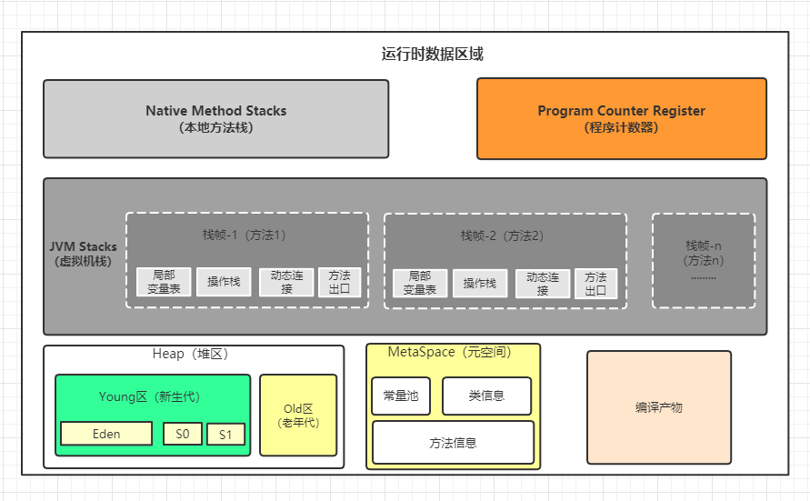

# Java内存区域详解

对于 Java 程序员来说，在JVM自动内存管理机制下，不再需要像 C/C++程序开发程序员这样为每一个 new 操作去写对应的 delete/free 操作， 
但也正因为 Java 程序员把内存控制权利交给 Java 虚拟机，一旦出现内存泄漏和溢出方面的问题，如果不了解虚拟机是怎样使用内存的，那么排查错误
将会是一个非常艰巨的任务。

JVM在执行程序的过程中会把它管理的内存划分成若干个不同的区域（以Java8为例）：

## 程序计数器（线程私有）

程序计数器是一块较小的内存空间，可以看作是当前线程所执行的字节码的行号指示器。
字节码解释器工作时通过改变这个计数器的值来选取下一条需要执行的字节码指令。
另外，多线程情况下，为了线程切换后能恢复到正确的执行位置，每条线程都需要有一个独立的程序计数器，
从而当线程被切换回来的时候能够知道该线程上次运行到哪儿了。

注意：程序计数器是唯一一个不会出现 OutOfMemoryError 的内存区域，它的生命周期随着线程的创建而创建，随着线程的结束而死亡。

## Java 虚拟机栈（线程私有）

Java 虚拟机栈（后文简称栈）也是线程私有的，它的生命周期和线程相同。
栈绝对算的上是 JVM 运行时数据区域的一个核心，除了一些 Native 方法调用是通过本地方法栈实现的(后面会提到)，其他所有的 Java 
方法调用都是通过栈来实现的（也需要和其他运行时数据区域比如程序计数器配合）。方法调用的数据需要通过栈进行传递，每一次方法调用
都会有一个对应的栈帧被压入栈中，每一个方法调用结束后，都会有一个栈帧被弹出。栈由一个个栈帧组成，而每个栈帧中都拥有：
局部变量表、操作数栈、动态链接、方法返回地址。和数据结构上的栈类似，两者都是先进后出的数据结构，只支持出栈和入栈两种操作。
栈空间虽然不是无限的，但一般正常调用的情况下是不会出现问题的。不过，如果函数调用陷入无限循环的话，就会导致栈中被压入太多栈帧
而占用太多空间，导致栈空间过深。那么当线程请求栈的深度超过当前 Java 虚拟机栈的最大深度的时候，就抛出 StackOverFlowError 错误。
Java 方法有两种返回方式，一种是 return 语句正常返回，一种是抛出异常。不管哪种返回方式，都会导致栈帧被弹出。也就是说， 
栈帧随着方法调用而创建，随着方法结束而销毁。无论方法正常完成还是异常完成都算作方法结束。除了 StackOverFlowError 错误之外，
栈还可能会出现OutOfMemoryError错误，这是因为如果栈的内存大小可以动态扩展， 如果虚拟机在动态扩展栈时无法申请到足够的内存空间，
则抛出OutOfMemoryError异常。
由于Java的栈只保存栈帧数据，以及基本类型和非基本类型的引用，所以单纯的在方法里创建对象不会导致栈溢出，StackOverFlowError的
原因基本是由于递归调用未及时退出。

## 本地方法栈（线程私有）

本地方法栈和虚拟机栈所发挥的作用非常相似，区别是：虚拟机栈为虚拟机执行 Java 方法 （也就是字节码）服务，
而本地方法栈则为虚拟机使用到的 Native 方法服务，本地方法栈不受JVM限制。 

## Java堆（所有线程共享）

**GC主要针对该区域**

Java 虚拟机所管理的内存中最大的一块，Java 堆是所有线程共享的一块内存区域，在虚拟机启动时创建。此内存区域的唯一目的就是存放对象实例，
几乎所有的对象实例以及数组都在这里分配内存。Java 世界中“几乎”所有的对象都在堆中分配（基本类型对象和对象引用在栈上），但是，随着 JIT 
编译器的发展与逃逸分析技术逐渐成熟， 栈上分配、标量替换优化技术将会导致一些微妙的变化，所有的对象都分配到堆上也渐渐变得不那么“绝对”了。
从 JDK 1.7 开始已经默认开启逃逸分析，如果某些方法中的对象引用没有被返回或者未被外面使用（也就是未逃逸出去），那么对象可以直接在栈上分配内存。
Java 堆是垃圾收集器管理的主要区域，因此也被称作 GC 堆（Garbage Collected Heap）。从垃圾回收的角度，由于现在收集器基本都采用分代垃圾收集算法，
所以 Java 堆还可以细分为：新生代和老年代；再细致一点有：Eden、Survivor、Old 等空间。进一步划分的目的是更好地回收内存，或者更快地分配内存。
OutOfMemoryError 错误一般都发生在堆。

## 方法区（所有线程共享）

方法区（Method Area）与 Java 堆一样，是所有线程共享的内存区域。
方法区用于存储已经被虚拟机加载的类信息（即加载类时需要加载的信息，包括版本、field、方法、接口等信息）、final常量、静态变量、编译器即时编译的代码等。
方法区逻辑上属于堆的一部分，但是为了与堆进行区分，通常又叫“非堆”。
方法区比较重要的一部分是运行时常量池（Runtime Constant Pool）。
Class 文件中除了有类的版本、字段、方法、接口等描述信息外，还有用于存放编译期生成的各种字面量（Literal）和符号引用（Symbolic Reference）的 常量池表(Constant Pool Table) 。
字面量是源代码中的固定值的表示法，即通过字面我们就能知道其值的含义。字面量包括整数、浮点数和字符串字面量。常见的符号引用包括类符号引用、字段符号引用、方法符号引用、接口方法符号。
既然运行时常量池是方法区的一部分，自然受到方法区内存的限制，当常量池无法再申请到内存时会抛出 OutOfMemoryError 错误。

## 元空间（所有线程共享，Java8及以后版本替代方法区）
1.8就把方法区改用元空间了。类的元信息被存储在元空间中。元空间没有使用堆内存，而是与堆不相连的本地内存区域。
所以，理论上系统可以使用的内存有多大， 元空间就有多大，所以不会出现永久代存在时的内存溢出问题。

## 直接内存

直接内存是一种特殊的内存缓冲区，并不在 Java 堆或方法区中分配的，而是通过 JNI 的方式在本地内存上分配的。直接内存并不是虚拟机运行时数据区的一部分，
也不是虚拟机规范中定义的内存区域，但是这部分内存也被频繁地使用。而且也可能导致 OutOfMemoryError 错误出现。JDK1.4 中新加入的 NIO（Non-Blocking I/O，也被称为 New I/O），
引入了一种基于通道（Channel）与缓存区（Buffer）的 I/O 方式，它可以直接使用 Native 函数库直接分配堆外内存，然后通过一个存储在 Java 堆中的 DirectByteBuffer 对象作为
这块内存的引用进行操作。这样就能在一些场景中显著提高性能，因为避免了在 Java 堆和 Native 堆之间来回复制数据。直接内存的分配不会受到 Java 堆的限制，但是，
既然是内存就会受到本机总内存大小以及处理器寻址空间的限制。类似的概念还有 堆外内存 。在一些文章中将直接内存等价于堆外内存，个人觉得不是特别准确。
堆外内存就是把内存对象分配在堆外的内存，这些内存直接受操作系统管理（而不是虚拟机），这样做的结果就是能够在一定程度上减少垃圾回收对应用程序造成的影响。
