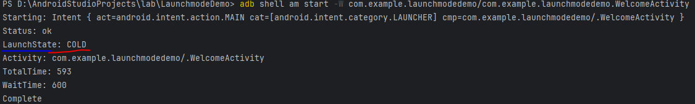

# APM (Application Performance Monitoring)

## 启动优化

### 启动类型及简要流程

- 冷启动
  点击app图标->创建app进程->创建activity
- 温启动
  App进程已存在，只需要创建activity。比如一直按返回键退回到桌面，
  此时所有activity已经销毁但是进程仍然存在，再次点击app图标不会重新创建进程，只会重新创建activity。
  还有一种情况是进程被销毁了，但activityrecord还在，系统可能会自动重建app进程然后直接拉起该activity。
- 热启动
  将app从后台拉回前台

可以通过命令"adb shell am start -W"启动目标Activity，查看启动耗时，并查看启动类型是冷启动还是热启动：

启动的完整过程，以冷启动为例：
launcher->AMS->zygote->app->AMS->
//下面的流程是我们可以参与的：
app#attachBaseContext->
app#onCreate->
contentProvider#onCreate->
activity->onCreate

onCreate中不要做耗时操作，一些耗时操作可以异步执行。
（但有时执行流程依赖耗时操作的结果，如SDK的startup耗时较长）
Activity中不要Inflating复杂的layout，尽量扁平化。不需要理解展示的view尽量用ViewStub占位。
第三方SDK往往会利用contentProvider做一些初始化工作，可以通过merged清单文件查看多了哪些provider。

### 启动耗时统计方法

- logcat中过滤"Displayed"
- adb shell am start -S -W 包名/目标activity
  C:\Users\sissi>adb shell am start -W com.example.launchmodedemo/.WelcomeActivity
  Starting: Intent { act=android.intent.action.MAIN cat=[android.intent.category.LAUNCHER] cmp=com.example.launchmodedemo/.WelcomeActivity }
  Status: ok
  LaunchState: COLD  // 冷启动（App进程不存在，从头启动）
  Activity: com.example.launchmodedemo/.WelcomeActivity
  TotalTime: 650 // 从进程启动到activity显示出来
  WaitTime: 655 // 从上一个前台activity paused到当前activity显示出来
  Complete

C:\Users\sissi>adb shell am start -W com.example.launchmodedemo/.WelcomeActivity
Starting: Intent { act=android.intent.action.MAIN cat=[android.intent.category.LAUNCHER] cmp=com.example.launchmodedemo/.WelcomeActivity }
Status: ok
LaunchState: WARM // 温启动（返回键退回到桌面，Activity销毁了但App进程仍存在）
Activity: com.example.launchmodedemo/.WelcomeActivity
TotalTime: 212 // 不需要启动App进程，只需要启动activity
WaitTime: 219
Complete

C:\Users\sissi>adb shell am start -W com.example.launchmodedemo/.WelcomeActivity
Starting: Intent { act=android.intent.action.MAIN cat=[android.intent.category.LAUNCHER] cmp=com.example.launchmodedemo/.WelcomeActivity }
Warning: Activity not started, intent has been delivered to currently running top-most instance.
Status: ok
LaunchState: UNKNOWN (0)
Activity: com.example.launchmodedemo/.WelcomeActivity
TotalTime: 0 // app进程和activity都存在，不需要重新创建
WaitTime: 17
Complete

## 内存优化

- AS自带的Memory Profiler。最直观边操作边观察内存使用情况变化。（需要debug版本，意味着线上版本不能用）
- adb shell dumpsys系列命令。 能看到概览。
  adb shell dumpsys activity activities $package 可以查看app的task/activity详情
  注意：如果activity泄漏了（走到了onDestroy但实际未能回收成功），dumpsys activity看不出异常。
       即dump结果中没有该泄漏了的activity，此时用命令"dumpsys meminfo"可以看到app中实际存在的activity数量。
       对比"dumpsys activity"中的结果或UI观察的结果可知道泄漏了多少activity。
- adb shell am dumpheap <PID> savePath （手机上的path而非电脑，如 /data/local/tmp/dump.hprof） 导出hprof文件。
  然后导入AS的memory profiler分析。（需要debug版本，意味着线上版本不能用）
- 可以在app中添加调试按钮导出hprof文件。（需要debug版本，意味着线上版本不能用）
- 在日志中周期性打印内存使用情况。（Debug版本中使用）
- LeakCanary（Debug版本中使用）。默认仅针对Android的几个组件Activity,Fragment,Service等，要针对其他对象需要写代码Watch。

1、内存泄漏的根本原因在于生命周期长的对象持有了生命周期短的对象的引用
2、常见场景
（1）资源对象没关闭造成的内存泄漏（如： Cursor、File等）
（2）全局集合类强引用没清理造成的内存泄漏（特别是 static 修饰的集合）
（3）接收器、监听器注册没取消造成的内存泄漏，如广播，eventsbus
（4）Activity 的 Context 造成的泄漏，可以使用 ApplicationContext
（5）单例中的static成员间接或直接持有了activity的引用
（6）非静态内部类持有父类的引用，如非静态handler持有activity的引用
3、如何避免内存泄漏
（1）编码规范上：
①资源对象用完一定要关闭，最好加finally
②静态集合对象用完要清理
③接收器、监听器使用时候注册和取消成对出现
④context使用注意生命周期，如果是静态类引用直接用ApplicationContext
⑤使用静态内部类
⑥结合业务场景，设置软引用，弱引用(可以使用ReferenceQueue监控弱引用被释放情况，被释放的会被添加到ReferenceQueue)，
确保对象可以在合适的时机回收
（2）建设内存监控体系
线下监控：
①使用ArtHook检测图片尺寸是否超出imageview自身宽高的2倍
②编码阶段Memery Profile看app的内存使用情况，是否存在内存抖动，内存泄漏，结合Mat分析内存泄漏
线上监控：
①上报app使用期间待机内存、重点模块内存、OOM率
②上报整体及重点模块的GC次数，GC时间
// ③使用LeakCannery自动化内存泄漏分析（默认只debug版本）
总结：
上线前重点在于线下监控，把问题在上线前解决；上线后运营阶段重点做线上监控，结合一定的预警策略及时处理
4、真的出现低内存，设置一个兜底策略
低内存状态回调，根据不同的内存等级做一些事情，比如在最严重的等级清空所有的bitmap，关掉所有界面，直接强制把app跳转到主界面，
相当于app重新启动了一次一样，这样就避免了系统Kill应用进程，与其让系统kill进程还不如浪费一些用户体验，自己主动回收内存。

## 耗电优化

# 自定义View

## 使用场景

- 特殊的显示形式。如圆靶、饼状图、跳动的心。一般View需要重写onMeasure,onDraw，ViewGroup需要重写onMeasure,onLayout。
- 特殊的交互方式。如图片浏览器KImageView。一般重写onTouchEvent。
- 为了方便复用封装一组已有控件以单一控件的形式提供使用。如标题栏、工具栏。
- 优化布局。如自定义FlexboxLayout就是出于这个目的。

## 涉及主题

- onMeasure手动计算View大小。计算需结合父view的限制以及自身的需求，最终将计算结果通过setMeasuredDimension报告父View。一般这会是最终的size,但父View可能还会施加限制（如FlexboxLayout的换行策略），并最终通过layout告知子View其实际尺寸。
- onDraw手动绘制View内容。
- onLayout,ViewGroup在这里调用子View的layout告知子View其实际大小。View不需要重写该方法。
- onTouchEvent(返回true消费)/onInterceptTouchEvent(仅ViewGroup，返回true表示截获，false则继续投递给子View)自定义交互。
- PorterDuffXfermode 实现刮刮乐、遮罩、形状定制图片等效果
- 属性动画、视图动画（补间动画、帧动画）

# singletop,singletask,singleinstance应用场景

# handler message详解

