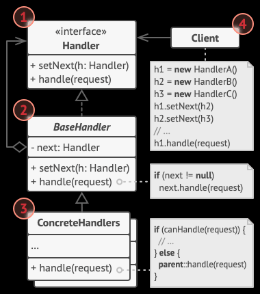

# 设计模式

## 高内聚低耦合

高内聚，低耦合是软件工程中的概念，它是判断软件好坏的一个重要指标。
该原则可以体现在软件的方方面面、各个层次，如函数、类、模块、系统，都可以以该原则来指导设计，或以之为标准来评判优劣。
然而该原则较为抽象，很难指导具体的实践，SOLID原则是“高内聚低耦合”在不同场景下的衍生。

### 内聚性(Cohesion)

内聚性是指一个模块内各部件之间相关性的强弱程度。若相关性强，我们称之为高内聚，反之为低内聚。
提高内聚性的一个关键是定义好模块的职责。
说明：此处的“模块”是抽象的概念，可以是函数、类、包、子系统等等。

**高内聚的好处**：

- 降低了模块的复杂度  
  高内聚模块内各部件之间相关性强，共同协作完成的职责单一，这往往使得模块比较精炼。
- 增加了可维护性  
  高内聚意味着和外界相关性小，所以变更模块实现对其他模块的影响甚小，反之亦然。  
- 增加了模块的可复用性  
  高内聚的模块更易于被复用，因为它职责明确且职责范围内功能完备且不会引入使用者不期望的不相关的依赖，从而加重使用者的负担甚至使复用不可行。

**内聚性类别**
内聚性从弱到强依次分为以下类别：

- 偶然性内聚  
  没有任何关联的部件被组织在了一起。比如一个大杂烩式的工具类，包含文本助手、文件助手、网络助手等。或者说一个utils工具包，包含了各种功能上毫无关联的uitl。

- 逻辑性内聚  
  本质上不同的部件因为某种逻辑层面的关联被组织在了一起。比如MVC模式中将所有的Contorller存放在同一个Controller目录下，
  只因它们逻辑上都是Contorller，尽管它们内容上毫无关联。又比如数据类型转换模块（如SDK的ToDoConverter），它的部件（各个函数）之间毫无关联，只是因为它们都是用来转换数据类型的，所以被组织在了一起。又如错误处理模块（处理各种错误，错误之间没有关联）。

- 时间性内聚  
  各部件仅仅因为在同一时间段工作而被组织在了一起。常见的如Startup/Cleanup模块，内部会有许多初始化/清理的工作，这些工作之间关联性并不强，只是因为它们都需要在启动/结束阶段完成而被组织在了一起。
  时间性内聚的模块很难被复用，原因就是它内部的部件之间功能上是没有关联的，所以它们在一起完成的工作对外呈现也没有一个功能含义，自然就难以被复用。复用一定是功能性的，不会说我要复用你的“初始化阶段”。

- 过程式内聚
- 通信式内聚  
  各部件因为输入输出对象相同而被组织在了一起。常见的如文件工具类，各个函数都是以文件为输入或输出，但函数之间关联性较低。又如数据库表操作类。

- 顺序性内聚
- 功能性内聚  
  模块内各元素是为了完成单一的被良好定义的功能而组织在一起

说明：功能性内聚是我们追求的目标，但其他内聚也可酌情考虑。

### 耦合性(Coupling)

## SOLID原则

“SOLID”是取几个原则的缩写的首字母形成的单词，“结实的，牢固的”的词义也蕴含着“遵循这些原则将使软件更加健壮”的含义。
SOLID原则是软件设计的基本原则，设计模式是对该原则的实践。


## 单一职责原则(SRP——Single Responsibility Principle)

简单说就是提高内聚性，一个类、接口只做一件事或一组相关性较高的事，而非出于种种原因把相关性不高的事丢在一起。

## 开闭原则（OCP——Open Close Principle）

一个类应该对于扩展是开放的，但是对于修改是封闭的。
在一开始编写代码时，就应该注意尽量通过扩展的方式实现新的功能，而不是通过修改已有的代码实现，否则容易破坏原有的系统，也可能带来新的问题，如果发现没办法通过扩展来实现，应该考虑是否是代码结构上的问题，通过重构等方式进行解决。

## 里氏替换原则（LSP——Liskov Substitution Principle）

所有引用基类的地方必须能透明地使用其子类对象。

## 迪米特原则（LoD——Law of Demeter （ Least Knowledge Principle））

一个对象只需要知道它该知道的（完成它的职责所需要知道的），不相干尽量少了解。
就像地下情报工作者尽量只知道自己该知道的，整个组织就不容易出大事。

## 接口隔离原则（ISP——Interface Segregation Principle）

类之间的依赖关系应该建立在最小的接口上。
其原则是将非常庞大的、臃肿的接口拆分成更小的更具体的接口。
跟“单一职责”、“迪米特”有相通性。

## 依赖倒置原则（DIP——Dependency Inversion Principle）

一般我们模块之间的关系是上层模块依赖下层模块，使用下层模块提供的接口完成某些功能，而下层模块提供的这些接口往往是具体实现相关的，并不稳定。

而这个原则就是要求改变这种“自然而然”的依赖关系。 变成：
具体的依赖抽象的（代码层面往往是接口）——
高层模块不应该依赖底层模块（具体实现），二者都应该依赖其抽象（抽象类或接口），比如MVP模式中的VP之间的依赖就是通过接口（抽象的）。

变化的依赖稳定的——
具体实现是可能随时变化的，接口是稳定的

次要的依赖主要的——
业务模块往往是一个产品最重要的模块，所以它应该尽量保持独立性，不应该依赖其他模块的具体实现细节。
比如我一个视频会议业务模块，既可以在android平台用，也可以在ios模块用（假设不考虑语言差异），那该模块就不应该依赖android平台或ios平台相关的东西。
那样无法保持独立性了。而应该由该模块自己定义接口，不同平台提供不同的实现该接口的适配器来接入该业务模块。就像OS和驱动之间的关系。尽管驱动在OS下层，但他们之间的接口是由OS定义的。
更详细的可参考Clean架构。

面向接口编程，提取出事务的本质和共性。

## 控制反转

所谓控制反转就是反转获取依赖对象的过程。传统的是自己需要用到某个对象时自己“主动”去创建，控制反转就是不需要自己主动去创建，而是“被动”接收，
往往是通过方法参数传入。常见的具体实现有两种：DI(Dependency Inject)依赖注入（如android的Dagger框架）和“依赖查找”（Dependency Lookup）。

# 设计模式

设计模式是对SOLID原则的实践。
设计模式大致分三类：（类对象的）创建型、（类之间的）结构型、（类之间的）行为型。

## 创建型

创建型封装了对象的创建细节，使得使用者创建符合需求的对象更加便捷。

### 简单工厂

简单工厂模式又叫做静态工厂方法模式（static Factory Method pattern）,它是通过使用静态方法接收不同的参数来返回不同的实例对象。
实例：

```java

/**产品接口**/

public interface Product {
    void doSomething();
}

/**具体产品实现**/
class ProductA implements Product{
    public void doSomething() {
        System.out.println("我是ProductA");
    }
}

class ProductB implements Product{
    public void doSomething() {
        System.out.println("我是ProductB");
    }
}

/**简单工厂**/
public class SimpleFactory { // 就一个工厂
    /**工厂类创建产品静态方法**/
    public static Product createProduct(String productName) {  // 一般是静态方法，返回的是接口对象而非具体的Product
        Product instance = null;
        switch (productName){
            case "A":
                instance = new ProductA();
                break;
            case "B":
                instance = new ProductB();
                break;
        }
        return instance;
    }

    /**客户端(client)调用工厂类**/
    public static void main(String[] args) {
        Product product = SimpleFactory.createProduct("A"); // 客户端不需要了解创建对象的具体细节，甚至不需要知道具体的对象。（它只需知道是个product）
        product.doSomething();
        product = SimpleFactory.createProduct("B");
        product.doSomething();
    }
}

```

client不直接new对象而是通过工厂创建对象，自然是为了封装client不想关注的细节。
简单工厂的client只需要知道它要创建的对象的标识符（如这里的“A”、“B”）以及他需要的是一个product（具体是什么product不关注），这样至少代码上有个显而易见的好处就是依赖的类数量减少了。
缺点：违背开闭原则，如果需要新增其他产品类，就必须在工厂类中新增if-else逻辑判断（可以通过配置文件来改进）。
    但是整体来说，系统扩展还是相对其他工厂模式要困难。

Android的getSystemService(String serviceName)就是简单工厂模式的例子。

### 工厂方法模式

工厂方法模式对比简单工厂模式，多了工厂的接口和各个不同的工厂。原本一个工厂的任务拆分到各自不同工厂了。

````java

/**产品相关的定义同简单工厂模式**/
.....


/**多了工厂接口**/
public interface AbstractFactory {
    /**创建Product方法,区别与工厂模式的静态方法**/
    public Product createProduct();
}


/**多了具体工厂实现**/
class FactoryA implements AbstractFactory{
    public Product createProduct() {
        return new ProductA();
    }
}


class FactoryA implements AbstractFactory{
    public Product createProduct() {
        return new ProductA();
    }
}


class FactoryA implements AbstractFactory{
    public Product createProduct() {
        return new ProductA();
    }
}

/**客户端调用工厂**/
public class Client {
    public static void main(String[] args) {
        Product productA = new FactoryA().createProduct(); // 和简单工厂方法一样，客户端仍然无需关心创建对象的具体过程，甚至具体的对象是什么。
                                                            但是就像前面需要知道对象标识符“A”一样，client需要知道产品A对应的工厂是FactoryA
        productA.doSomething();
        Product productB = new FactoryB().createProduct();
        productB.doSomething();
    }
}

````
现在要新增产品可以不用修改已有代码了，而是新增一种工厂。符合了“开-闭原则”。
但是每新增一种产品就要新增一个具体的Product类和Factory类。

### 抽象工厂模式

抽象工厂模式适用于生产“产品族”的场景。

比如数据协作的PaintBord/Painter/PaintFactory就是抽象工厂模式实现的。
PaintBord和Painter都是产品，他们是配套使用的，是一个产品族。一个factory要同时生产这两类产品，也就是生产一个产品族。
每个产品都有自己的接口定义，每个工厂也有自己的接口定义，这点和工厂方法一样。但是多了一个“产品族”的概念，就是一次不是只生产一类产品，
而是生产一个产品族。

上面列举了三种工厂模式，他们的初衷都是一样的，即对用户隐藏创建对象的具体细节，只不过他们适用的场景不一样。
如针对产品族的场景适用抽象工厂。 用户甚至不知道创建的具体对象是什么，他只知道对象的抽象接口类型，他是通过接口引用对象的，也是通过接口引用工厂的。
这样的好处就是扩展性可维护性很好，当用户想要替换另一个产品时只需要在代码中换用另一工厂，可能就是改一行代码的事。更进一步，用户可以通过配置文件
来配置要使用的工厂，这样完全不必改代码，只需要改配置文件，等程序重新价值配置文件，工厂也更新了。

### 单例模式

有的类我们只需要一个实例，多个实例不仅没必要有时可能还会造成混乱或资源浪费，这种情况下我们采取一些手段让客户只能创建出一个类实例，这种模式就是单例模式。
单例模式的使用场景有很多，Android的众多系统服务都是单例的，比如AM，WM，PM等。
WindowManager wm = (WindowManager)getSystemService(getApplication().WINDOW_SERVICE);
很多语言都内置了语言机制来支持这种模式，比如kotlin的object类。这样省去了用户自己实现（什么懒汉模式、线程锁之类的细节）。

### 生成器（Builder）模式
有时候一个对象非常复杂，成员变量都有几十个。这时要构造这个对象，调用构造方法传递几十个参数显然不可取，即便可以多重载几个构造函数针对不同场景
内部初始化一些参数，这也非常麻烦。这个时候就可以考虑使用Builder模式了。
比如android中的
AlertDialog.Builer builder=new AlertDialog.Builder(context);
builder.setIcon(R.drawable.icon)
.setTitle("title")
.setMessage("message")
.setPositiveButton("Button1",
new DialogInterface.OnclickListener(){
public void onClick(DialogInterface dialog,int whichButton){
setTitle("click");
}   
})
.create()
.show();

Builder模式可以将复杂的构造过程，拆分成一个个的set，一般支持链式调用，也可以在代码的不同阶段set不同的字段，而不必像调用构造时一股脑全部传入。
只有等到最终调用构建方法时才会真正执行对象构造。如上面的show()，一般是build()方法。

### 原型模式
原型模式，即Prototype，是指创建新对象的时候，根据现有的一个原型来创建。
我们举个例子：如果我们已经有了一个String[]数组，想再创建一个一模一样的String[]数组，怎么写？
实际上创建过程很简单，就是把现有数组的元素复制到新数组。如果我们把这个创建过程封装一下，就成了原型模式。用代码实现如下：
// 原型:
String[] original = { "Apple", "Pear", "Banana" };
// 新对象:
String[] copy = Arrays.copyOf(original, original.length);
对于普通类，我们如何实现原型拷贝？Java的Object提供了一个clone()方法，
它的意图就是复制一个新的对象出来，我们需要实现一个Cloneable接口来标识一个对象是“可复制”的。

通过“复制”一个已经存在的实例来返回新的实例,而不是新建实例。被复制的实例就是我们所称的“原型”，这个原型是可定制的。
原型模式多用于创建复杂的或者耗时的实例，因为这种情况下，复制一个已经存在的实例使程序运行更高效；或者创建值相等，只是命名不一样的同类数据。
原型模式是在内存二进制流的拷贝， 要比直接new一个对象性能好很多， 特别是要在一个循环体内产生大量的对象时， 原型模式可以更好地体现其优点。
原型模式还可以避免构造函数的约束 ，这既是它的优点也是缺点，直接在内存中拷贝，构造函数是不会执行的 。 优点就是减少了约束， 缺点也是减少了约束， 需要大家在实际应用时考虑。
这里需要注意的一点是“深拷贝”和“浅拷贝”的区别，只有深拷贝出来的才是完全不同的对象。
Java的Object中提供了clone方法，这是原型模式的一个例子。

实际上，创建对象包含的申请内存、给成员变量赋值这一过程，本身并不会花费太多时间，或者说对于大部分业务系统来说，这点时间完全是可以忽略的。
应用一个复杂的模式，只得到一点点的性能提升，这就是所谓的过度设计，得不偿失。这种情况，不建议使用原型模式。
如果对象中的数据需要经过复杂的计算才能得到（比如排序、计算哈希值），或者需要从 RPC、网络、数据库、文件系统等非常慢速的 IO 中读取，
这种情况下，我们就可以利用原型模式，从其他已有对象中直接拷贝得到，而不用每次在创建新对象的时候，都重复执行这些耗时的操作。
此时，建议使用原型模式，如数据库连接池、线程池等各种资源池。

很多实例会持有类似文件、Socket这样的资源，这些资源是无法复制给另一个对象共享的。


## 结构型

### 适配器模式

#### 使用场景
需要使用现有类，但其接口不符合系统需求，而我们无法修改它或者修改它不合适时。（往往用于事后补救，已经存在了某个功能类，想使用但接口又不符合需求）；
需要一个统一的输出接口，而输入类型不可预知（往往在类体系结构设计时就包含了Adapter。如Android的各种集合View和Adapter。因为View加载数据的方式相对统一，但数据的来源以及获取方式却多种多样无法预估）；

#### 角色组成
目标接口（Target）：客户期望的接口。
适配者类（Adaptee）：一个已存在的类，提供了客户需要的功能但接口不是客户期望的。
适配器类（Adapter）：实现了Target接口，因而客户可以直接和其打交道，同时通过组合或继承的方式将客户的请求转交给Adaptee处理。

#### 优缺点
优点：
    可以复用已有类；
    允许类的设计更加灵活同时又不降低复用性。Adapter不一定是在需要复用已有类的时候才考虑添加的，也可能是在设计类体系结构的时候就考虑添加Adapter这一环了。
比如，Android的ListView和Adapter是一开始就设计好的（adapter是listview的一个成员变量）。
可能成为Adaptee的类（可能是一整套）在设计的时候可能无法照顾到所有的使用场景，
但它仍然可以按照已有的一套标准来设计，标准以外的情况可以通过适配器来处理。如电器，国外标准的电器到中国来尽管电气参数不同仍然可以通过各种适配器使用。

缺点：
过度使用适配器可能导致系统结构混乱，难以理解和维护。

#### 代码实现
如：在生活中手机充电器, 需要将家用220V的交流电 转换为 5V的直流电后, 才能对手机充电。
手机充电器 相当于 Adapter适配器
220V的交流电 相当于 Adaptee 被适配者
5V的直流电 相当于 Target目标
手机 相当于 客户

````
public class Phone {
    public void charging(Target voltage) { // charging接受的参数是5V的Target，所以下面的Adaptee没法直接使用
        if (voltage.output5V() == 5) {
            System.out.println("电压适配为5V，可以充电");
        } else if (voltage.output5V() > 5) {
            System.out.println("电压大于5V，不能充电～");
        }
    }
}

public interface Target { // Phone期望的电压
    public int output5V();
}

public class Adaptee { // 已有了Adaptee，想利用但是不符合Phone#charging的入参要求
    public int output220V() {
        System.out.println("正常220V电压");
        return 220;
    }
}

// 于是定义适配器完成转换

// // 类适配器模式
// public class Adapter extends Adaptee implements Target { // adaptee是通过继承的方式（JAVA不支持多重继承，所以Target得是接口才可实现类适配器模式）
//     @Override
//     public int output5V() {
//         // 获取到220V的电压
//         int a = output220V();
//         // 处理电压，转成5V
//         int b = a / 44;
//         return b;
//     }
// }

// 对象适配器模式（优先使用这种方式）
public class Adapter implements Target {
    private Adaptee adaptee; // adaptee是通过组合的方式而非继承

    public Adapter(Adaptee adaptee) {
        this.adaptee = adaptee;
    }

    @Override
    public int output5V() {
        int dst = 0;
        if (adaptee != null) {
            int src = adaptee.output220V();
            System.out.println("使用对象适配器进行适配");
            dst = src / 44;  // 转换电压
            System.out.println("适配完成，输出电压为：" + dst);
        }
        return dst;
    }
}


public class Test {
    public static void main(String[] args) {
        Phone phone = new Phone();
        phone.charging(new Adapter(new Adaptee()));
    }
}

````

### 桥接模式

#### 使用场景
若类的体系结构可以朝不同维度独立发展则应考虑这样做，而不是揉在一个维度发展，这样会导致类数量爆炸。
比如有形状类Shape，其有子类Circle和Square，后来有了新的需求需要有红色/蓝色的circle和Square，
这时我们不应该新建类RedCircle/RedSquare/BlueCircle/BlueSquare，这样就是在一个维度“形状与颜色”上扩展类，
而是应该新建一个Color类体系,子类Red/Blue，这样就是两个维度了：形状、颜色。然后当你需要Red的Circle时，通过组合的方式获取：
Circle里面包含Color属性值为Red。之前的方式是通过继承的方式获取的，这也说明了组合很多时候优于继承。


### 组合模式

#### 使用场景
当类体系结构具有树状结构时，且类本质上有相似性，用户可以将他们当做同一类对象处理时，可以考虑使用组合模式。
常见的如文件系统，其中的文件夹、文件都可以抽象为文件，文件夹不过是特殊的文件，其内包含了其他文件；又如组织架构，部门、小组、员工都可以抽象为“节点”，
不过员工是叶子节点，其他节点内部可以包含节点。这样的设计往往能使算法利用上递归处理，从而使逻辑变得简单。
当你想要针对某个某个节点做某些计算的时候，你只需要调用该节点的方法，然后请求会自动顺着树形结构传递到每一个子节点，最终返回总的结果。

#### 角色组成
- 组件 （Component） 接口描述了树中简单项目和复杂项目所共有的操作。

- 叶节点 （Leaf） 是树的基本结构， 它不包含子项目。

- 一般情况下， 叶节点最终会完成大部分的实际工作， 因为它们无法将工作指派给其他部分。

- 容器 （Container）——又名 “组合 （Composite）”——是包含叶节点或其他容器等子项目的单位。 容器不知道其子项目所属的具体类， 它只通过通用的组件接口与其子项目交互。

容器接收到请求后会将工作分配给自己的子项目， 处理中间结果， 然后将最终结果返回给客户端。

- 客户端 （Client） 通过组件接口与所有项目交互。 因此， 客户端能以相同方式与树状结构中的简单或复杂项目交互。


### 装饰模式
通过使用组合而非继承的方式扩展类的功能。
修饰模式是类别继承的另外一种选择。类继承在编译时候增加行为，而装饰模式是在运行时增加行为。

修饰模式是类别继承的另外一种选择。类继承在编译时候增加行为，而装饰模式是在运行时增加行为。

当有几个相互独立的功能需要扩充时，这个区别就变得很重要。在有些面向对象的编程语言中，类别不能在运行时被创建，通常在设计的时候也不能预测到有哪几种功能组合。这就意味著要为每一种组合创建一个新类别。相反，修饰模式是面向运行时候的对象实例的,这样就可以在运行时根据需要进行组合。

装饰类和被装饰类可以独立发展，不会相互耦合，装饰模式是继承的一个替代模式，装饰模式可以动态扩展一个实现类的功能。
装饰模式与继承关系的目的都是要扩展对象的功能，但是装饰模式可以提供比继承更多的灵活性。装饰模式允许系统动态决定“贴上”或者除掉一个“装饰”，继承关系是静态的，它在系统运行前就决定了；
通过使用不同的具体装饰类以及这些装饰类的排列组合，设计师可以创造出很多不同行为的组合；
装饰者类可以在被装饰者的行为前面或后面加上自己的行为，甚至取代被装饰者的行为，达到特定的目的；

装饰模式和桥接模式有共同点都是类结构在多维度演进，但桥接模式两部分之间不需要是实现同一个接口，而装饰模式需要是实现同一个接口。
这使得它可以在运行时增加功能。

#### 使用场景
需要扩展一个类的功能，或给一个类增加附加责任。
需要动态的给一个对象增加功能，这些功能可以再动态地撤销。
需要增加一些基本功能的排列组合而产生的非常大量的功能，从而使继承变得不现实。

#### 角色组成

#### 已知用例
Java IO 流为典型的装饰模式。


### 外观模式

#### 使用场景
当有一个复杂的子系统，需要使用它完成某些功能，但直接使用可能会使客户代码陷入子系统的复杂细节中，如各种对象创建，众多接口调用，业务逻辑处理。
这时可以使用该模式创建一个“外观”对象封装这些细节同时为客户提供一个简洁的API集。“外观”对象也可以拆分以避免“外观”本身过于庞大。

SDK往往是使用该模式的很好的例子，如confsdk。

外观模式回归了最原始的封装的意图。

#### 角色组成

- 外观 （Facade） 提供了一种访问特定子系统功能的便捷方式， 其了解如何重定向客户端请求， 知晓如何操作一切活动部件。

- 附加外观 （Additional Facade） 类可以避免多种不相关的功能污染单一外观， 使其变成又一个复杂结构。 客户端和其他外观都可使用附加外观。

- 复杂子系统 （Complex Subsystem） 由数十个不同对象构成。 如果要用这些对象完成有意义的工作， 你必须深入了解子系统的实现细节， 比如按照正确顺序初始化对象和为其提供正确格式的数据。子系统类不会意识到外观的存在， 它们在系统内运作并且相互之间可直接进行交互。

- 客户端 （Client） 使用外观代替对子系统对象的直接调用。


### 享元模式

#### 使用场景
当系统中存在大量同质对象，占用大量资源时，可以考虑将该对象拆解，将所有对象共有的且“只读”的属性提取出来形成新的共享对象——享元对象。
原有对象=拆解后的对象+享元对象（通过包含享元对象的引用）。
在这个模式中，享元对象的数量是有限的，且享元对象中包含的属性占用的资源较多，这样相当于通过共享这些大头的资源降低了系统整体的资源消耗。
需要注意的是享元中的属性必须是“只读”的，否则它就不能共享了而只能每个对象有自己独立一份了。


### 代理模式

#### 使用场景
在客户调用原接口之前你期望做一些其他工作，比如添加日志、记录耗时、控制权限、远程过程调用（代理封装了进程间通信细节）等。

#### 角色组成

- 服务接口 （Service Interface） 声明了服务接口。 代理必须遵循该接口才能伪装成服务对象。

- 服务 （Service） 类提供了一些实用的业务逻辑。

- 代理 （Proxy） 类包含一个指向服务对象的引用成员变量，且需实现服务接口（这样客户能像使用服务一样使用代理）。 代理完成其任务 （例如延迟初始化、 记录日志、 访问控制和缓存等） 后会将请求传递给服务对象。

通常情况下， 代理会对其服务对象的整个生命周期进行管理。

- 客户端 （Client） 能通过同一接口与服务或代理进行交互， 所以你可在一切需要服务对象的代码中使用代理。

## 行为型

### 责任链模式

责任链模式是一种行为设计模式， 允许你将请求沿着处理者链进行发送。 收到请求后， 每个处理者均可对请求进行处理， 或将其传递给链上的下个处理者。

#### 使用场景

SDK处理消息时用到

#### 角色组成



### 迭代器模式

可以让用户在无需关注集合底层表现形式 （列表、 栈和树等） 的情况下以统一的方式遍历集合（常常是多种集合）中所有的元素。

遍历是集合的常用功能，如果集合是列表的实现，那遍历很简单，类似`for(i=0;i<size;++i)`这样就行了，但是如果集合是树形结构，甚至图，
那遍历的逻辑可能就很复杂了。另外除了集合底层结构的差异，遍历的算法也有差异，有时我们希望以不同的方式遍历集合，如正序、倒序、深度优先、广度优先等，这时遍历的逻辑就更复杂了。
我们希望客户无需关注这些具体的细节，客户只关注一件事“能够以我期望的方式（如正序、倒序）遍历完集合”，并且支持将来轻松替换遍历的方式，并且各个集合的遍历方式统一，这样即使将来替换集合实现，代码改动也很小，学习成本也低。
这就是迭代器模式的初衷。
java的集合类都提供有各种类型的Iterator，通过xxxIterator()成员方法获取。
具体实现参考java集合。

### 中介者模式

中介者模式是一种行为设计模式， 能让你减少对象之间混乱无序的依赖关系。 该模式会限制对象之间的直接交互， 迫使它们通过一个中介者对象进行合作。
想象没有集线器要连接多台电脑需要每两台电脑之间牵一条网线，而加上集线器后就成了中介者模式。又比如找房子，没有中介和有中介，有中介就是中介者模式。

#### 角色组成


### 备忘录模式

