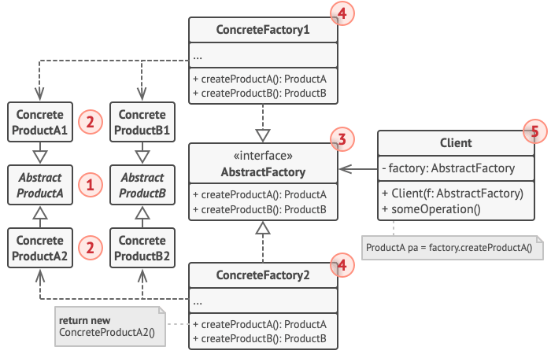
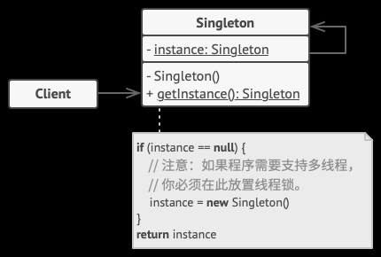
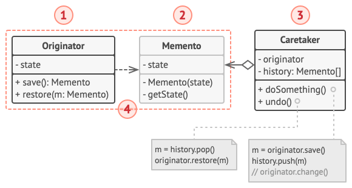
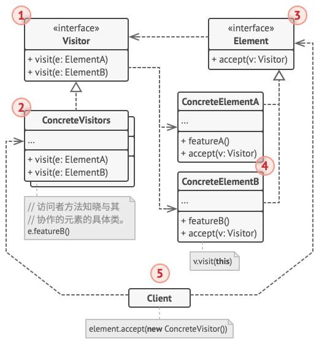

# 设计模式详解

## 高内聚低耦合

软件设计中有一个非常基本而重要的原则“高内聚低耦合”，设计模式是其具体实践。
该原则可以体现在软件的方方面面、各个层次，如函数、类、模块、系统，都可以以该原则来指导设计，或以之为标准来评判优劣。
然而该原则较为抽象，很难指导具体的实践，SOLID原则是“高内聚低耦合”在不同场景下的衍生。

### 内聚性(Cohesion)

内聚性是指一个模块内各部件之间相关性的强弱程度。若相关性强，我们称之为高内聚，反之为低内聚。
提高内聚性的一个关键是定义好模块的职责。
**说明**：此处的“模块”是抽象的概念，可以是函数、类、包、子系统等等，“部件”亦是。对于一个类来说，其“部件”包括属性字段、方法、内部类、甚至注释等等一切组成该类的元素。

**高内聚的好处**：

- 降低了模块的复杂度  
  高内聚模块内各部件之间相关性强，共同协作完成的职责单一，这往往使得模块比较精炼。
- 增加了可维护性  
  高内聚意味着和外界相关性小，所以变更模块实现对其他模块的影响甚小，反之亦然。  
- 增加了模块的可复用性  
  高内聚的模块更易于被复用，因为它职责明确且职责范围内功能完备且不会引入使用者不期望的不相关的依赖，从而加重使用者的负担甚至使复用不可行。另外，用户寻找可复用模块时一般是通过模块的功能标识，高内聚的模块往往是功能性内聚的，对外有一个明确的功能性标识。

**内聚类别**
内聚性从弱到强依次分为以下类别：

- 偶然性内聚  
  没有任何关联的部件被组织在了一起。比如一个大杂烩式的工具类，包含文本助手、文件助手、网络助手等。或者说一个utils工具包，包含了各种功能上毫无关联的uitl。

- 逻辑性内聚  
  本质上不同的部件因为某种逻辑层面的关联被组织在了一起。比如MVC模式中将所有的Contorller存放在同一个Controller目录下，
  只因它们逻辑上都是Contorller，尽管它们内容上毫无关联。又比如数据类型转换模块（如SDK的ToDoConverter），它的部件（各个函数）之间毫无关联，只是因为它们都是用来转换数据类型的，所以被组织在了一起。又如错误处理模块（处理各种错误，错误之间没有关联）。
  逻辑性内聚常常表现为模块内的部件同属于某一逻辑分类，除此之外它们没有任何功能上的关联。

- 时间性内聚  
  各部件仅仅因为在同一时间段工作而被组织在了一起。常见的如Startup/Cleanup模块，内部会有许多初始化/清理的工作，这些工作之间关联性并不强，只是因为它们都需要在启动/结束阶段完成而被组织在了一起。
  时间性内聚的模块很难被复用，原因就是它内部的部件之间功能上是没有关联的，所以它们在一起完成的工作对外呈现也没有一个功能含义，自然就难以被复用。复用一定是功能性的，不会说我要复用你的“初始化阶段”。

- 过程式/步骤式内聚  
  各部件因需要按指定的顺序/步骤执行以完成某个任务而被组织在了一起。如一个openFile的函数，其内部先调用了checkPermission，然后才真正的open，则该openFile函数是过程式内聚的。其内的check和open可能分属不同模块因打开文件需包含的特定步骤而被组织在了一起。

- 通信式内聚  
  各部件因为输入输出对象相同而被组织在了一起。常见的如文件工具类，各个函数都是以文件为处理对象，但函数之间功能性关联较低。又如数据库表操作类。

- 顺序性内聚  
  因前一个部件的输出是后一个部件的输入而被组织在了一起，就像一条流水线。如协议包的层层封装（加头）或解封。

- 功能性内聚  
  模块内各元素是为了完成单一的被良好定义的功能而组织在一起。此为最理想的内聚。

**说明**：尽管上面给内聚性高低排了序，但并不代表我们任何时候都要强求最高的内聚性——功能性内聚。模块能达成什么样的内聚性跟我们对模块指定的职责有很大关系，如初始化模块注定是时间性内聚的，因为我们给它的任务就是初始化阶段要做的事。顶层模块如main方法注定是过程性内聚的，因为它的职责就是按步骤执行一些操作完成某个任务。除了偶然性内聚和逻辑性内聚不推荐外，其余的都有合适的使用场景。

### 耦合性(Coupling)

耦合性是指模块之间相互依赖的程度。依赖程度高称为高耦合，反之低耦合。
低耦合往往意味着高内聚。
**说明**：此处的“模块”是抽象的概念，可以是函数、类、包、子系统等等。

**高耦合的坏处（高内聚的好处取反）**：

- 增加了复杂度  
  耦合的本质是依赖，耦合度越高，意味着关系越复杂（或者说不合理），自然增加了复杂度。
- 降低了可维护性  
  耦合模块一处修改往往会波及与之耦合的其它模块也要相应修改，反之亦然，大大增加了维护成本。  
  同理，由于耦合模块依赖了其它模块，单独针对该模块测试往往很困难。
- 降低了可复用性  
  由于依赖其它模块，复用该模块就必须同时引入其它模块，单独复用不可能。而且耦合的模块功能性标志往往比较模糊，也不利于使用者的选用判断。

**耦合类别**
耦合性从强到弱依次分为以下类别：

- 内容耦合  
  A模块直接引用/依赖B模块的内部细节时，如A模块直接访问B模块的内部成员变量（往往由于设计缺陷导致不得不这么做），
  或者A模块的实现依赖B模块的内部细节，如A模块假定B模块定义了某个值为"XXX"的字符串，并依此实现了自己的逻辑，一旦B模块未定义该字符串或改变了该字符串的值，则A模块将工作异常。
- 公共耦合  
  AB模块共同依赖了某个全局变量，则AB称为公共耦合。它可能导致无法控制的错误传播和不可预见的副作用。
- 外部耦合  
  AB模块共同依赖某个数据格式、通信协议等。
- 控制耦合  
  A模块通过向B传递某些信息控制B的执行。比如传递一个“what-to-do”的标志。
- 印记耦合  
  A使用某个结构体的前半部分，B只需要该结构体的后半部分。A修改了前半部分可能导致B的逻辑变化。（应该只传给B它需要的部分）
- 数据耦合  
  如A给B的函数传递了一个整型参数。

**说明**：高内聚低耦合往往是伴生出现的，模块内聚性越高则模块间耦合度越低。

## SOLID原则

前面提到“高内聚低耦合”是软件设计的基本原则，SOLID则是其在不同场景下的衍生。
“SOLID”是几个原则的集合，名称即是这几个原则的首字母缩写。“结实的，牢固的”的词义也蕴含着“遵循这些原则将使软件更加健壮”的含义。
SOLID原则是业内普遍遵循的原则，设计模式是对该原则的实践。

### 单一职责原则(SRP——Single Responsibility Principle)

一个模块只做一件事或一组相关性较高的事。即追求功能性内聚。

### 开闭原则（OCP——Open Close Principle）

一个模块应该对扩展是开放的，但是对于修改是封闭的。
更直白一点说，当我们尝试添加一个功能的时候，已有的系统不应受到波及（不需要修改代码），而只需要在已有系统的基础上新增代码即可。如果已有系统的各模块都是高内聚低耦合的，这个目标就是比较好实现的。
在一开始编写代码时，就应该注意尽量通过扩展的方式实现新的功能，而不是通过修改已有的代码实现，否则容易破坏原有的系统，也可能带来新的问题，如果发现没办法通过扩展来实现，应该考虑是否是代码结构上的问题，通过重构等方式进行解决。想象一下SDK的兼容性便很好理解了。

### 里氏替换原则（LSP——Liskov Substitution Principle）

所有引用基类的地方必须能透明地使用其子类对象而不破坏原有的代码。
里氏替换原则更多的是对类继承体系设计的一种指引和验证。类之间必须是is-a的关系而非has-a的关系才能使用继承，has-a需要使用组合。
很多时候我们直觉上属于继承关系（is-a）的类实际上并不是，这时就可以使用该原则加以判断。比如经典的“正方形该不该是矩形的子类”问题。
现实世界的直觉告诉我们答案是肯定的，正方形是矩形的子类，因为它只是边长相等的矩形，是矩形的特例。然而在软件设计的世界中它们却不能是继承关系。为什么？
因为这里现实到软件世界的映射出现了偏差，里面的概念已经被偷换了，我们所定义的只是我们在某方面运用到的长方形和正方形。它的定义是全新的，包括了里面所有的数据和所有的方法。不再是我们在数学中定义的长方形和正方形。假设我们认为它们是继承的关系，软件世界我们会如下定义正方形和矩形：

````java

class Rectangle{
  int width;
  int height;

  void setWidth(int width){
    this.width = width;
  }

  void setHeight(int height){
    this.height = height;
  }
}

class Square extends Rectangle{
  void setWidth(int width){
    super.setWidth(width);
    super.setHeight(width);
  }

  void setHeight(int height){
    setWidth(height);
  }
}

````

假设有如下业务逻辑代码：

````java

void f(Rectangle rect){
  rect.setWidth(5);
  rect.setHeight(4); // 对于正方形来说，宽高都是一样的，所以最终不是5*4而是4*4
  int area = rect.width * rect.height;
  print("area="+area);
}

Rectangle square = new Square(); // 这里子类替代父类会导致f的结果异常。违反了LSP原则。
f(square);

````

上面``Rectangle square = new Square();``这里子类替代父类会导致f的结果异常，违反了LSP原则，说明正方形不应是矩形的子类（他们可以拥有共同的基类如“四边形”）。

又比如鲸鱼和鱼，现实中鲸鱼是哺乳动物，映射到软件设计它和鱼之间不应存在继承，但如果我们只考虑它在水中生活习性，并以此建模，如他们都会游泳，相似的外形，则可以将其设计为鱼的子类。这些都说明我们将现实世界的概念映射到软件世界中时，有意无意的都可能出现偏差，这是我们应该慎用继承的原因之一。

### 迪米特原则（LoD——Law of Demeter （ Least Knowledge Principle））

一个对象只需要知道它该知道的（完成它的职责所需要知道的），不相干尽量少了解。
即追求功能性内聚。

### 接口隔离原则（ISP——Interface Segregation Principle）

接口不应设计的过大，从而导致其用户被迫依赖他不需要的部分。换句话说，接口在能完成其职责的前提下应该设计的尽量小一些。
即追求功能性内聚，或者说避免印记耦合。
单一职责原则、迪米特原则、接口隔离原则都是“功能性内聚”的不同体现。

### 依赖倒置原则（DIP——Dependency Inversion Principle）

模块之间的依赖关系不应是上层依赖下层或使用者依赖库（传统情况），而应该是具体的依赖抽象的，变化的依赖稳定的，次要的依赖重要的。
具体到实现层面就是AB模块之间的依赖关系应该通过接口建立，而非直接的A模块引用B模块的实现。
具体实现容易变化，抽象的接口相对稳定，所以说“变化的依赖稳定的”。“次要的依赖重要的”——比如，业务模块往往是一个产品最重要的模块，所以它应该尽量保持独立性，不应该依赖其他模块的具体实现细节。当依赖关系不可避免时，应该由业务模块定义接口，其他模块提供实现，就像OS和驱动的关系一样，尽管驱动在更底层的位置。（可参考Clean架构）
这个原则也体现了“高内聚低耦合”，是避免“内容耦合”的实践。

## 其它原则

### 慎用继承，优先组合

虽然面向对象一定程度上是现实世界的映射，我们可以类比现实来设计我们的类体系，这也是它大受欢迎的原因，但这种映射很容易产生偏差，导致的最常见的后果就是错误的设计类之间的继承关系。另外继承相较于组合类之间的耦合更加强力，组合更加灵活。尽管类设计的偏差取决于设计者对领域的理解和抽象，不会因为继承或组合有所差别，但正因为组合是更松散的耦合所以这种偏差带来的负面效果会更小。设计模式中大量践行了该原则。

### 控制反转

传统的过程式编程中，自己写的上层代码调用下层库完成特定的任务，控制的方向是从上层用户代码到下层库。
而在“控制反转”中，调用的方向是下层（框架层）调用上层用户代码。控制可以理解为“调用”，“反转”可以理解为调用的方向，谁调用谁。
控制反转被广泛应用于各种框架，如Android框架，Application、Activity等组件生命周期回调都是框架发起的。
在Java世界中，控制反转通常特指“对象的获取方式的反转”——用户需要使用的对象不需要用户自己创建，而是由框架负责创建然后以某种方式“注入”。目的是将对象的创建和使用分开，降低耦合度。
常见的具体实现有两种：DI(Dependency Inject)依赖注入（如android的Dagger框架）和“依赖查找”（Dependency Lookup）。

## 设计模式

设计模式是对SOLID原则的实践。
设计模式分三类：（类对象的）创建型、（类之间的）结构型、（类之间的）行为型。
<sub>*注：我们默认是在面向对象编程领域讨论设计模式*</sub>

### 创建型

很多情况下Client代码直接new对象是不妥的：

- 对象的创建需要复杂的过程，不适合包含在Client中跟业务逻辑混在一起；
- 对象的创建需要Client无法访问的信息；
- 对象的创建不是Client关注的一部分；
- 对象类别将来可能变更，或者说可以灵活配置，但变更时不希望影响到Client；

创建型设计模式由两个主导思想组成：

- 对用户隐藏使用了哪些具体类（用户持有的是接口引用，不清楚具体创建的是什么Class的对象）；
- 对用户隐藏这些类的实例是如何创建和组合的（比如直接从对象池缓存获取而非新建，比如进行了复杂的配置等）；

上面的隐藏不是目的，并不是为了隐藏而隐藏，而是因为隐藏这些细节可以实现良好的封装，使得用户业务逻辑和繁琐复杂的对象创建逻辑解耦。

创建设计模式进一步分为对象创建模式和类创建模式。
对象创建模式将对象创建委派给另一个对象，基于组合；而类创建模式将创建对象的工作延迟到了子类，基于继承。

#### 简单工厂模式（Simple Factory Pattern）

工厂模式是通过调用工厂方法替代直接调用构造函数来创建对象的。由于多了一层工厂方法，便可完成诸多细节的封装，如鉴权、缓存、各种配置等。
简单工厂模式又叫做静态工厂方法模式（static Factory Method pattern），因为它是使用静态方法作为工厂方法。
它的最常见的实现是定义一个静态工厂方法接受一个表示类别的参数，根据参数生产不同的产品对象。
另外一种形式的实现是定义多个静态工厂方法，比如生产产品的原料各异，根据不同原料定义不同静态工厂方法，但返回同一种产品。比如Android的BitmapFactory。

##### 类图


##### 代码实现

```java

//产品接口
public interface Product {
    void doSomething();
}

//具体产品A
class ProductA implements Product{
    public void doSomething() {
        System.out.println("我是ProductA");
    }
}

//具体产品B
class ProductB implements Product{
    public void doSomething() {
        System.out.println("我是ProductB");
    }
}

//简单工厂
public class SimpleFactory {
    public static Product createProduct(String productName) {  // 一般是静态方法，返回的是接口对象而非具体的Product
        Product instance = null;
        switch (productName){
            case "A":
                instance = new ProductA();
                break;
            case "B":
                instance = new ProductB();
                break;
            //! 若要扩展产品需在此处增加，产品的创建也可能不仅仅是new一下这么简单，所以最终SimpleFactory可能变得很臃肿。    
        }
        return instance;
    }

    //客户(client)使用
    public static void main(String[] args) {
        // 客户代码不需要了解创建对象的具体细节，甚至不需要知道具体的对象类型。
        String flag = parseFromConfigFile(); // 具体需要创建哪种产品可以通过配置文件控制，这样变更产品时不用变更client代码。
        Product product = SimpleFactory.createProduct(flag); // flag解析出来"A"或"B"
        product.doSomething();
    }
}

```

##### 适用场景

- 产品类别较少且品种固定（也可以只一种产品像BitmapFactory那样）。这是使用简单工厂模式的前提。因为简单工厂的工厂方法是硬编码的，添加产品需要修改工厂方法违反了“开闭原则”，并且产品太多会导致工厂过于臃肿难以维护。
- 当产品的创建（或者说获取）较为复杂时。比如需要鉴权逻辑、需要缓存机制、数据来源各种各样（像BitmapFactory）等，可以使用工厂方法封装这些细节，以避免污染Client主体业务逻辑；
- 当Client想要自由切换产品类型而不必修改Client代码时。可以定义单独的静态工厂方法，通过配置文件配置想要生产的产品类型，运行时从配置文件解析产品类型，达到完全不用修改Client代码的目的。

##### 应用实例

- Android的getSystemService(String serviceName)
- Android的BitmapFactory。上面代码实例中工厂方法只有一个，参数是一个flag，这只是最简单的情况，也可能是像BitmapFactory这样多个工厂方法，多种不同参数。总之形式上都是用一个工厂方法替代构造方法来创建对象，并在工厂方法中封装具体的创建细节。

#### 工厂方法模式（Factory method pattern）

工厂方法模式中的工厂和产品都有各自的接口，工厂方法不再是静态的，而是由子工厂具体实现，生产具体的产品。

工厂方法属于类创建模式，它将对象的创建延迟到子类。

##### 类图


##### 代码实现

````java

//产品相关的定义同简单工厂模式
...

//工厂接口
public interface AbstractFactory {
    /**创建Product方法,区别与简单工厂模式的静态方法**/
    public Product createProduct();
}

//具体工厂A
class FactoryA implements AbstractFactory{
    public Product createProduct() {
        return new ProductA();
    }
}

//具体工厂B
class FactoryB implements AbstractFactory{
    public Product createProduct() {
        return new ProductB();
    }
}//! 每新增一个产品都需要新增一对Product和Factory类

//客户端使用
public class Client {
    // 说明：我们仅展示了最简单的情况以突出模式的代码骨架。但实际工厂方法可以封装更多的创建对象的复杂细节。
    public static void main(String[] args) {
        // 和简单工厂方法一样，客户端仍然无需关心创建对象的具体过程，甚至具体的对象是什么。
        String factoryFullName = parseFromConfigFile(); // 具体需要创建哪种产品可以通过配置文件控制，这样变更产品时不用变更client代码。
        // 通过反射创建具体的工厂类，这样变更工厂时client代码完全不受影响。
        Class<?> factoryClass = Class.forName(factoryFullName);
        Constructor<?> ctor = factoryClass.getDeclaredConstructor();
        ctor.setAccessible(true);
        Factory factory = (Factory) ctor.newInstance();
        /* 我们前面在简单工厂模式中提到当新增产品时需要修改SimpleFactory的实现，违反了“开闭原则”。
          但我们似乎可以效仿此处使用反射替代new来达到不用修改SimpleFactory的目的。
          然而产品类和工厂类的区别在于产品类的创建可能很复杂不仅仅是new一下，
          这就意味着即使使用反射创建出了对象，我们仍然需要针对该对象添加许多代码，无法达到不修改SimpleFactory的目的。
          而Factory本身是非常简单的，只反射创建一下对象就可以了。
        */

        Product product = factory.createProduct(); 
        product.doSomething();
    }
}

````

##### 适用场景

- 简单工厂模式适用的场景工厂方法模式均可胜任，除此之外若还需要扩展产品类，则应选择工厂方法模式。不同于简单工厂模式新增产品需修改已有的工厂类，工厂方法模式只需新增一对产品和工厂类，无需修改已有代码，符合“开闭原则”，扩展性良好。

##### 应用实例

- Java中的集合类的iterator。Iterator接口相当于Product接口，Collection相当于工厂接口，其中的iterator方法相当于工厂方法。各具体集合类（如ArrayList）相当于具体工厂。具体的Product以内部类的形式定义在各具体工厂内。如"ArrayList#Itr implements Iterator"。

#### 抽象工厂模式

工厂方法模式中的工厂只创建一种产品，而抽象工厂模式中的工厂用于生产“产品族”。
比如，用户期望是生产一套风格一致的家具，包括桌、椅、门等，并且随时可以替换风格（目前有中式美式两种风格）。
如果按工厂方法实现，首先我们需要中式桌工厂、中式椅工厂、中式门工厂、美式桌工厂、美式椅工厂、美式门工厂，
其次，我们需要根据用户要求小心组装避免中美混搭（但代码机制上无法保证不犯错误）。如果使用抽象工厂模式则只需要中式家具工厂和美式家具工厂，
每个工厂都生产整套风格一致的桌椅门，替换风格只需要替换一个工厂即可。

##### 类图



##### 代码实现

参见sdk数据协作

##### 适用场景

- 同工厂方法模式，但是将其中的“产品”替换为“产品族”。
- 抽象工厂模式的扩展性针对的是“产品族”，所以无法以符合“开闭原则”的方式单独添加“产品”，所以它不适用于产品需要经常扩展的情况。

##### 应用实例

Android的MediaPlayerFactory；
比如数据协作的PaintBord/Painter/PaintFactory就是抽象工厂模式实现的。
PaintBord和Painter都是产品，他们是配套使用的，是一个产品族。一个factory要同时生产这两类产品，也就是生产一个产品族。SDK提供了Default的实现版本，用户可以直接用，如果不符合要求也可以自己实现然后一键替换。

#### 单例模式

有的类我们只需要一个实例，多个实例不仅没必要有时可能还会造成混乱或资源浪费，这种情况下我们采取一些手段让客户只能创建出一个类实例，这种模式就是单例模式。
单例模式的使用场景有很多，Android的众多系统服务都是单例的，比如AM，WM，PM等。
WindowManager wm = (WindowManager)getSystemService(getApplication().WINDOW_SERVICE);
很多语言都内置了语言机制来支持这种模式，比如kotlin的object类。这样省去了用户自己实现（什么懒汉模式、线程锁之类的细节）。

##### 类图



##### 应用实例

单例模式的应用非常常见，如各种Manager往往是单例的，Android中的PMS,AMS,WMS也都是单例的。

#### 生成器模式（Builder）

有时候一个对象非常复杂，成员变量都有几十个。这时要构造这个对象，调用构造方法传递几十个参数显然不可取，即便可以多重载几个构造函数针对不同场景
内部初始化一些参数，这也非常麻烦。这个时候就可以考虑使用Builder模式了。
Builder模式可以将复杂的构造过程，拆分成一个个的set，一般支持链式调用，也可以在代码的不同阶段set不同的字段，而不必像调用构造时一股脑全部传入。
只有等到最终调用构建方法时才会真正执行对象构造。如上面的show()，一般是build()方法。

##### 适用场景

对象本身非常复杂，成员众多

##### 应用实例

Android中的对话框创建、通知创建等。

````java
AlertDialog.Builer builder=new AlertDialog.Builder(context);
builder.setIcon(R.drawable.icon)
      .setTitle("title")
      .setMessage("message")
      .setPositiveButton("Button1", new DialogInterface.OnclickListener(){
        public void onClick(DialogInterface dialog,int whichButton){
            setTitle("click");
          }   
        })
      .create()
      .show();
````

SDK中许多复杂的类如会议参数都可以适用Builder模式。

#### 原型模式

通过“复制”一个已经存在的实例来返回新的实例,而不是新建实例。被复制的实例就是我们所称的“原型”，这个原型是可定制的。

举个例子：如果我们已经有了一个String[]数组，想再创建一个一模一样的String[]数组，怎么写？
实际上创建过程很简单，就是把现有数组的元素复制到新数组。如果我们把这个创建过程封装一下，就成了原型模式。用代码实现如下：

````java
String[] original = { "Apple", "Pear", "Banana" };
String[] copy = Arrays.copyOf(original, original.length); // 这里就不是一个个的new对象而是直接复制，通过直接复制代替new创建对象这就是原型模式的本质。
````

对于普通类，我们如何实现原型拷贝？Java的Object提供了一个clone()方法，
它的意图就是复制一个新的对象出来，我们需要实现一个Cloneable接口来标识一个对象是“可复制”的。

##### 适用场景

原型模式关注点是效率。
原型模式多用于创建复杂的或者耗时的实例，因为这种情况下，复制一个已经存在的实例使程序运行更高效；或者创建值相等，只是命名不一样的同类数据。
原型模式是在内存二进制流的拷贝， 要比直接new一个对象性能好很多， 特别是要在一个循环体内产生大量的对象时， 原型模式可以更好地体现其优点。
原型模式还可以避免构造函数的约束 ，这既是它的优点也是缺点，直接在内存中拷贝，构造函数是不会执行的 。 优点就是减少了约束， 缺点也是减少了约束， 需要大家在实际应用时考虑。
这里需要注意的一点是“深拷贝”和“浅拷贝”的区别，只有深拷贝出来的才是完全不同的对象。
Java的Object中提供了clone方法，这是原型模式的一个例子。

实际上，创建对象包含的申请内存、给成员变量赋值这一过程，本身并不会花费太多时间，或者说对于大部分业务系统来说，这点时间完全是可以忽略的。
应用一个复杂的模式，只得到一点点的性能提升，这就是所谓的过度设计，得不偿失。这种情况，不建议使用原型模式。
如果对象中的数据需要经过复杂的计算才能得到（比如排序、计算哈希值），或者需要从 RPC、网络、数据库、文件系统等非常慢速的 IO 中读取，
这种情况下，我们就可以利用原型模式，从其他已有对象中直接拷贝得到，而不用每次在创建新对象的时候，都重复执行这些耗时的操作。
此时，建议使用原型模式，如数据库连接池、线程池等各种资源池。
很多实例会持有类似文件、Socket这样的资源，这些资源是无法复制给另一个对象共享的。

##### 应用实例

Java的Object中提供了clone方法；
Android中的Bitmap#copy方法；
Android中的Intent#clone方法；

### 结构型

#### 适配器模式

将一个类的接口转接成用户所期待的。

##### 类图


##### 使用场景

适配器模式的关注点是复用。
需要使用现有类，但其接口不符合系统需求，而我们无法修改它或者修改它不合适时。（用于事后补救，而非事先设计好的。已经存在了某个功能类，想使用但接口又不符合需求）；
需要一个统一的输出接口，而输入类型不可预知（往往在类体系结构设计时就包含了Adapter。如Android的各种集合View和Adapter。因为View加载数据的方式相对统一，但数据的来源以及获取方式却多种多样无法预估）；

##### 角色组成

目标接口（Target）：客户期望的接口。
适配者类（Adaptee）：一个已存在的类，提供了客户需要的功能但接口不是客户期望的。
适配器类（Adapter）：实现了Target接口，因而客户可以直接和其打交道，同时通过组合或继承的方式将客户的请求转交给Adaptee处理。

##### 优缺点

优点：
    可以复用已有类；
    允许类的设计更加灵活同时又不降低复用性。Adapter不一定是在需要复用已有类的时候才考虑添加的，也可能是在设计类体系结构的时候就考虑添加Adapter这一环了。
比如，Android的ListView和Adapter是一开始就设计好的（adapter是listview的一个成员变量）。
可能成为Adaptee的类（可能是一整套）在设计的时候可能无法照顾到所有的使用场景，
但它仍然可以按照已有的一套标准来设计，标准以外的情况可以通过适配器来处理。如电器，国外标准的电器到中国来尽管电气参数不同仍然可以通过各种适配器使用。

缺点：
过度使用适配器可能导致系统结构混乱，难以理解和维护。

##### 代码实现

如：在生活中手机充电器, 需要将家用220V的交流电 转换为 5V的直流电后, 才能对手机充电。
手机充电器 相当于 Adapter适配器
220V的交流电 相当于 Adaptee 被适配者
5V的直流电 相当于 Target目标
手机 相当于 客户

````java
public class Phone {
    public void charging(Target voltage) { // charging接受的参数是5V的Target，所以下面的Adaptee没法直接使用
        if (voltage.output5V() == 5) {
            System.out.println("电压适配为5V，可以充电");
        } else if (voltage.output5V() > 5) {
            System.out.println("电压大于5V，不能充电～");
        }
    }
}

public interface Target { // Phone期望的电压
    public int output5V();
}

public class Adaptee { // 已有了Adaptee，想利用但是不符合Phone#charging的入参要求
    public int output220V() {
        System.out.println("正常220V电压");
        return 220;
    }
}

// 于是定义适配器完成转换

// // 类适配器模式
// public class Adapter extends Adaptee implements Target { // adaptee是通过继承的方式（JAVA不支持多重继承，所以Target得是接口才可实现类适配器模式）
//     @Override
//     public int output5V() {
//         // 获取到220V的电压
//         int a = output220V();
//         // 处理电压，转成5V
//         int b = a / 44;
//         return b;
//     }
// }

// 对象适配器模式（优先使用这种方式）
public class Adapter implements Target {
    private Adaptee adaptee; // adaptee是通过组合的方式而非继承

    public Adapter(Adaptee adaptee) {
        this.adaptee = adaptee;
    }

    @Override
    public int output5V() {
        int dst = 0;
        if (adaptee != null) {
            int src = adaptee.output220V();
            System.out.println("使用对象适配器进行适配");
            dst = src / 44;  // 转换电压
            System.out.println("适配完成，输出电压为：" + dst);
        }
        return dst;
    }
}


public class Test {
    public static void main(String[] args) {
        Phone phone = new Phone();
        phone.charging(new Adapter(new Adaptee()));
    }
}

````

#### 桥接模式

用于将抽象部分与实现部分分离，使得它们可以独立地变化。

##### 使用场景

桥接模式主要解决“类爆炸”的问题。手段是使用组合替代继承。
若类的体系结构可以朝不同维度独立发展则应考虑这样做，而不是揉在一个维度发展，这样会导致类数量爆炸。
比如有形状类Shape，其有子类Circle和Square，后来有了新的需求需要有红色/蓝色的circle和Square，
这时我们不应该新建类RedCircle/RedSquare/BlueCircle/BlueSquare，这样就是在一个维度“形状与颜色”上扩展类，
而是应该新建一个Color类体系,子类Red/Blue，这样就是两个维度了：形状、颜色。然后当你需要Red的Circle时，通过组合的方式获取：
Circle里面包含Color属性值为Red。之前的方式是通过继承的方式获取的，这也说明了组合很多时候优于继承。

#### 组合模式

当对象模型具有树状结构时，可以将其中每一种对象抽象为“节点”，并通过组合的方式关联父子节点，以简化针对该树状结构的算法逻辑。

##### 类图


##### 角色组成

- 组件 （Component） 接口描述了树中简单项目和复杂项目所共有的操作。

- 叶节点 （Leaf） 是树的基本结构， 它不包含子项目。

- 一般情况下， 叶节点最终会完成大部分的实际工作， 因为它们无法将工作指派给其他部分。

- 容器 （Container）——又名 “组合 （Composite）”——是包含叶节点或其他容器等子项目的单位。 容器不知道其子项目所属的具体类， 它只通过通用的组件接口与其子项目交互。

容器接收到请求后会将工作分配给自己的子项目， 处理中间结果， 然后将最终结果返回给客户端。

- 客户端 （Client） 通过组件接口与所有项目交互。 因此， 客户端能以相同方式与树状结构中的简单或复杂项目交互。

##### 使用场景

组合模式主要用于对象模型具有树状结构的场景，关注的点是通过优化数据结构简化算法逻辑。
当类体系结构具有树状结构时，且类本质上有相似性，用户可以将他们当做同一类对象处理时，可以考虑使用组合模式。
常见的如文件系统，其中的文件夹、文件都可以抽象为文件，文件夹不过是特殊的文件，其内包含了其他文件；又如组织架构，部门、小组、员工都可以抽象为“节点”，
不过员工是叶子节点，其他节点内部可以包含节点。这样的设计往往能使算法利用上递归处理，从而使逻辑变得简单。
当你想要针对某个某个节点做某些计算的时候，你只需要调用该节点的方法，然后请求会自动顺着树形结构传递到每一个子节点，最终返回总的结果。

##### 应用实例

Android的View和ViewGroup。
sdk的组织架构就用到了组合模式。

#### 装饰模式

通过使用组合而非继承的方式扩展类的功能。
装饰模式是类继承的另外一种选择。类继承在编译时候增加行为，而装饰模式是在运行时增加行为。
当有几个相互独立的功能需要扩充时，这个区别就变得很重要。在有些面向对象的编程语言中，类别不能在运行时被创建，通常在设计的时候也不能预测到有哪几种功能组合，这就意味著要为每一种组合创建一个新类别很繁琐且难以实现。相反，装饰模式是面向运行时候的对象实例的,这样就可以在运行时根据需要进行组合。

装饰类和被装饰类可以独立发展，不会相互耦合，装饰模式是继承的一个替代模式，装饰模式可以动态扩展一个实现类的功能。
装饰模式与继承关系的目的都是要扩展对象的功能，但是装饰模式可以提供比继承更多的灵活性。装饰模式允许系统动态决定“贴上”或者除掉一个“装饰”，继承关系是静态的，它在系统运行前就决定了；
通过使用不同的具体装饰类以及这些装饰类的排列组合，设计师可以创造出很多不同行为的组合；
装饰者类可以在被装饰者的行为前面或后面加上自己的行为，甚至取代被装饰者的行为，达到特定的目的；

装饰模式和桥接模式有共同点都是类结构在多维度演进，但桥接模式两部分之间不需要是实现同一个接口，而装饰模式需要是实现同一个接口。
这使得它可以在运行时增加功能。

##### 类图


##### 使用场景

装饰模式关注的是类的功能扩展。可动态扩展和撤销，不可造成类爆炸。
需要扩展一个类的功能，或给一个类增加附加责任。
需要动态的给一个对象增加功能，这些功能可以再动态地撤销。
需要增加一些基本功能的排列组合而产生的非常大量的功能，从而使继承变得不现实。

##### 应用实例

Java IO 流为典型的装饰模式。
Android的ContextThemeWrapper,ContextWrapper, Context。

#### 外观模式

##### 使用场景

当有一个复杂的子系统，需要使用它完成某些功能，但直接使用可能会使客户代码陷入子系统的复杂细节中，如各种对象创建，众多接口调用，业务逻辑处理。
这时可以使用该模式创建一个“外观”对象封装这些细节同时为客户提供一个简洁的API集。“外观”对象也可以拆分以避免“外观”本身过于庞大。

SDK往往是使用该模式的很好的例子，如confsdk。

外观模式回归了最原始的封装的意图。

##### 应用实例

Android的ContextImpl
confsdk

##### 角色组成

- 外观 （Facade） 提供了一种访问特定子系统功能的便捷方式， 其了解如何重定向客户端请求， 知晓如何操作一切活动部件。

- 附加外观 （Additional Facade） 类可以避免多种不相关的功能污染单一外观， 使其变成又一个复杂结构。 客户端和其他外观都可使用附加外观。

- 复杂子系统 （Complex Subsystem） 由数十个不同对象构成。 如果要用这些对象完成有意义的工作， 你必须深入了解子系统的实现细节， 比如按照正确顺序初始化对象和为其提供正确格式的数据。子系统类不会意识到外观的存在， 它们在系统内运作并且相互之间可直接进行交互。

- 客户端 （Client） 使用外观代替对子系统对象的直接调用。

#### 享元模式

享元模式是一种结构型设计模式， 它摒弃了在每个对象中保存所有数据的方式， 通过共享多个对象所共有的相同状态， 让你能在有限的内存容量中载入更多对象。

##### 类图


##### 使用场景

当系统中存在大量同质对象，占用大量资源时，可以考虑将该对象拆解，将所有对象共有的且“只读”的属性提取出来形成新的共享对象——享元对象。
原有对象=拆解后的对象+享元对象（通过包含享元对象的引用）。
在这个模式中，享元对象的数量是有限的，且享元对象中包含的属性占用的资源较多，这样相当于通过共享这些大头的资源降低了系统整体的资源消耗。
需要注意的是享元中的属性必须是“只读”的，否则它就不能共享了而只能每个对象有自己独立一份了。
享元模式只是一种优化。 在应用该模式之前， 你要确定程序中存在与大量类似对象同时占用内存相关的内存消耗问题， 并且确保该问题无法使用其他更好的方式来解决。

##### 应用实例

Android的Message.obtain ?这不是对象池吗？

#### 代理模式

让你能够提供对象的替代品或其占位符。 代理控制着对于原对象的访问， 并允许在将请求提交给对象前后进行一些处理。

##### 类图


##### 角色组成

- 服务接口 （Service Interface） 声明了服务接口。 代理必须遵循该接口才能伪装成服务对象。

- 服务 （Service） 类提供了一些实用的业务逻辑。

- 代理 （Proxy） 类包含一个指向服务对象的引用成员变量，且需实现服务接口（这样客户能像使用服务一样使用代理）。 代理完成其任务 （例如延迟初始化、 记录日志、 访问控制和缓存等） 后会将请求传递给服务对象。

通常情况下， 代理会对其服务对象的整个生命周期进行管理。

- 客户端 （Client） 能通过同一接口与服务或代理进行交互， 所以你可在一切需要服务对象的代码中使用代理。

##### 使用场景

在客户调用原接口之前你期望做一些其他工作，比如添加日志、记录耗时、控制权限、远程过程调用（代理封装了进程间通信细节）等。

##### 应用实例

如Android Binder的service的本地proxy

### 行为型

#### 责任链模式

责任链模式是一种行为设计模式， 允许你将请求沿着处理者链进行发送。 收到请求后， 每个处理者均可对请求进行处理， 或将其传递给链上的下个处理者。

##### 类图


##### 使用场景

SDK处理消息时用到

##### 应用实例

在Android处理点击事件时，父View先接收到点击事件，如果父View不处理则交给子View，把责任依次往下传递；还有Java的异常捕获机制也是责任链模式的一种体现。
SDK的消息处理也应用了该模式。

#### 命令模式

将“请求”转换为一个包含与请求相关的所有信息的独立对象。 该转换让你能根据不同的请求将方法参数化、 延迟请求执行或将其放入队列中， 且能实现可撤销操作。
传统“请求”的含义即方法调用——调用方调用接收方的方法。将这个过程抽象出来独立成一个对象，这个对象我们称之为“命令”，现在调用方调用命令，命令再调用接收方，这样的模式被称为命令模式。

我们把模块A借助模块B完成某个任务的过程称为A“请求”B。
传统的请求方式是A直接调用B的方法

````java
class A{
  fun(){
    B.doSomething();
  }
}
````

但是现在的情况是：

- A不想关注或不需要关注B；
- A也不关注具体做了什么，它只需在特定时机触发执行动作即可；
- A虽然不关注具体做了什么，但是它可能想在某个时机撤销刚执行的操作；
- 需要在运行时能动态改变要执行的操作，或者希望通过某种方式(比如通过配置文件)方便改变执行的操作但不影响A的代码；
- 我们希望将doSomething对象化，这样这可以实现缓存、延迟执行、命令队列等功能。

为了实现上述目标我们尝试改变传统的请求方式：

````java  
interface Command{
  execute();
  undo();
}

class CommandB implements Command{
  B b; // 具体的命令关联的是具体的receiver
  CommandB(B b){
    this.b=b;
  }
  execute(){
    b.doSomething();
  }
  undo(){
    b.undoSomething();
  }
}


class A{
  Command command; // 这里保存的是Command引用，即A不关注具体的Command。A现在关联的只有一个Command接口，不再关注B以及具体做什么。
  fun(){
    command.execute(); // 不论是什么command，对于A来说只是简单的execute。
  }

  revoke(){
    command.undo();
  }

  setCommand(Command cmd){ 
    command = cmd;
  }
}

class Client{
  main(){
    String cmd = parseCmdFormCfgFile(); // 可以将要执行的命令通过配置文件设置，这样变更命令可以完全不用修改代码。
    Command command; 
    if (cmd.equals("b")){ 
      // 运行时根据情况决定即动态改变要执行的命令
      command = new CommandB(new B());
    }else if (cmd.equals("c")){
      ...
    }
    A a = new A();
    a.setCommand(command);
    if (xxx){
      command = new CommandC(new C()); // 运行时根据情况改变要执行的命令。比如A是快捷键，Command是绑定到该快捷键的功能，我们可以动态修改快捷键功能。
      a.setCommand(command);
    }
    a.fun();
    ...
    if (xxx){
      a.revoke(); // 撤销
    }
  }
}

````

通过上面代码我们可以看到，我们将B.doSomething()拆解为了Command{B b;}.execute()，并将A直接关联Command（Command是一个接口，这点很重要），这样就达成了上述目标。

##### 类图


##### 代码实现

智能生活项目需求：我们买了一套智能家电，与照明灯、风扇、冰箱、洗衣机，我们只要在手机上安装一个app就可以控制这些家电工作。

````java

// 命令
public interface Command {
    //执行命令
    void execute();
    //撤销
    void undo();
}

// 灯
public class LightReceiver {
    public void on() {
        System.out.println("电灯打开了");
    }
    public void off() {
        System.out.println("电灯关闭了");
    }
}

// 开灯命令
public class LightOnCommand implements Command {
    LightReceiver lightReceiver; //聚合了命令接收者
    public LightOnCommand(LightReceiver lightReceiver){
        this.lightReceiver=lightReceiver;
    }
    public void execute() {
        lightReceiver.on();
    }
    public void undo() {
        lightReceiver.off();
    }
}

// 关灯命令
public class LightOffCommand implements Command {
    LightReceiver lightReceiver;
    public LightOffCommand(LightReceiver lightReceiver){
        this.lightReceiver=lightReceiver;
    }
    public void execute() {
        lightReceiver.off();
    }
    public void undo() {
        lightReceiver.on();
    }
}

// 其它电器
...

// 空命令（用来初始化避免判null）
public class EmptyCommand implements Command {
    public void execute() {
    }
    public void undo() {
    }
}

// 遥控
public class RemoteController {
    //各个电器的打开命令数组
    Command[] onCommands; // 调用方不关注具体的命令，它持有的都是Command接口引用
    //各个电器的关闭命令数组
    Command[] offCommands;
    //最近的命令。用于撤销最近一次执行的命令。也可以做成一个history列表，可以一直撤销。
    Command lastCommand;

    public RemoteController() {
        onCommands = new Command[5];
        offCommands = new Command[5];
        for (int i = 0; i < 5; i++) {
            onCommands[i] = new EmptyCommand(); // 初始化为空命令，避免非null判定
            offCommands[i] = new EmptyCommand();
        }
    }

    //给各个遥控按钮（灯按钮、冰箱按钮...）设置你需要的命令
    public void setCommand(int no, // no指定是哪类电器
                             Command onCommand, Command offCommand) { // 调用方不关注具体的命令，所有的参数都是Command接口
        onCommands[no] = onCommand;
        offCommands[no] = offCommand;
    }

    //按下开的按钮
    public void onButtonWasPushed(int no) {
        //找到你按下的开的按钮，并调用对应方法
        onCommands[no].execute();
        //记录这次的操作，用于撤销
        lastCommand = onCommands[no];
    }

    //按下关的按钮
    public void offButtonWasPushed(int no) {
        //找到你按下的关的按钮，并调用对应方法
        offCommands[no].execute();
        //记录这次的操作，用于撤销
        lastCommand = offCommands[no];
    }

    //按下撤销的按钮
    public void undoButtonWasPushed(int no) {
        lastCommand.undo();
    }
}

// 用户代码
public class Client {
    public static void main(String[] args) {
        // 尽管调用者不关注具体的命令及其接收者，但这个关联的任务总要有人负责。
        // 用户负责将具体的命令、具体的接收者以及调用者三方关联起来
        //创建电灯的对象（接受者）
        LightReceiver lightReceiver = new LightReceiver();
        //创建电灯相关的开关命令
        LightOnCommand lightOnCommand = new LightOnCommand(lightReceiver);
        LightOffCommand lightOffCommand = new LightOffCommand(lightReceiver);
        //需要一个遥控器
        RemoteController remoteController = new RemoteController();
        //给各个电器设置命令,比如no-0是电灯的序号
        remoteController.setCommand(0,lightOnCommand,lightOffCommand);
        // 设置其它电器
        ...

        System.out.println("按下灯的开按钮");
        remoteController.onButtonWasPushed(0);
        System.out.println("按下灯的关按钮");
        remoteController.offButtonWasPushed(0);
        System.out.println("按下灯的撤销按钮");
        remoteController.undoButtonWasPushed(0); // 撤销关灯，灯又开了
    }
}

````

##### 适用场景

- 自定义按钮功能，如自定义快捷键  
  按钮对应调用方，只需要重新为其设置命令对象即可。
- 计划任务，如明天上午执行  
  命令支持序列化，你可以将其写入数据库，一段时间后拿出来执行；你还可以通过网络发送命令到远程接收者。
- 回滚、撤销等操作  
  可以为命令定义undo操作，并保存一个命令的history列表，这样需要回滚时遍历执行undo即可。  
  undo有两种具体实现方式，一种是回退对象的状态到执行前，这就需要保存对象之前的状态（可以利用备忘录模式）；另一种是执行相反的操作，就像上例中开灯的undo就是执行关灯操作，而非恢复之前保存的状态。两种方式各有利弊，前者耗费内存，后者有时难以实现。
  命令也可以定义为复合命令，其本身实现了command接口，但内部包含子命令列表，类似组合模式的文件夹和文件。

##### 应用实例

例如Java的线程池的使用就是用到了命令模式，线程池对象可以执行execute方法,execute方法参数就是一个Runnable指令，此时就可以创建一个Runnable命令对象。

#### 迭代器模式

可以让用户在无需关注集合底层表现形式 （列表、 栈和树等） 的情况下以统一的方式遍历集合（常常是多种集合）中所有的元素。

遍历是集合的常用功能，如果集合是列表的实现，那遍历很简单，类似`for(i=0;i<size;++i)`这样就行了，但是如果集合是树形结构，甚至图，
那遍历的逻辑可能就很复杂了。另外除了集合底层结构的差异，遍历的算法也有差异，有时我们希望以不同的方式遍历集合，如正序、倒序、深度优先、广度优先等，这时遍历的逻辑就更复杂了。
我们希望客户无需关注这些具体的细节，客户只关注一件事“能够以我期望的方式（如正序、倒序）遍历完集合”，并且支持将来轻松替换遍历的方式，并且各个集合的遍历方式统一，这样即使将来替换集合实现，代码改动也很小，学习成本也低。
这就是迭代器模式的初衷。

##### 应用实例

java的集合类都提供有各种类型的Iterator，通过xxxIterator()成员方法获取。
具体实现参考java集合。

#### 中介者模式

中介者模式是一种行为设计模式， 能让你减少对象之间混乱无序的依赖关系。 该模式会限制对象之间的直接交互， 迫使它们通过一个中介者对象进行合作。
想象没有集线器要连接多台电脑需要每两台电脑之间牵一条网线，而加上集线器后就成了中介者模式。又比如找房子，没有中介和有中介，有中介就是中介者模式。

##### 类图


#### 备忘录模式

又叫快照模式，允许在不暴露对象实现细节的情况下保存和恢复对象之前的状态。
备忘录对象是一个用来存储另外一个对象内部状态的快照的对象。备忘录模式的用意是在不破坏封装的条件下，将一个对象的状态捕捉(Capture)住，并外部化，存储起来，从而可以在将来合适的时候把这个对象还原到存储起来的状态。备忘录模式常常与命令模式和迭代子模式一同使用。

##### 类图



##### 应用实例

Activity的onSaveInstanceState和onRestoreInstanceState

#### 观察者模式（发布-订阅模式）

##### 应用实例

Android的各种listener，如onclicklistener、广播监听器、生命周期Observer
sdk的请求的ResultListener，以及NtfListner就是这种模式。

#### 状态模式

状态模式演变自传统状态机的过程式实现。
传统状态机：
class StateOwner{
  ...
  switch(state){
    case state1:
      dosomething;
    case state2:
      dosomething;
    case state3:
      dosomething;
    ...
  }
}
这种实现存在一些问题：
dosomething可能是很复杂的逻辑，case也可能扩展，扩展甚至需要修改已有case，总之该类会越来越臃肿混乱。
我们很难在设计阶段预测到所有可能的状态和转换。 随着时间推移， 最初仅包含有限条件语句的简洁状态机可能会变成臃肿的一团乱麻。

状态模式建议为对象的所有可能状态新建一个类， 然后将所有状态的对应行为抽取到这些类中。
原始对象被称为上下文 （context）， 它并不会自行实现所有行为， 而是会保存一个指向表示当前状态的状态对象的引用， 且将所有与状态相关的工作委派给该对象。如需将上下文转换为另外一种状态， 则需将当前活动的状态对象替换为另外一个代表新状态的对象。 采用这种方式是有前提的： 所有状态类都必须遵循同样的接口， 而且上下文必须仅通过接口与这些对象进行交互。

##### 类图


##### 模式对比

状态模式和策略模式结构上非常像，但策略模式各模式互相不了解，状态模式状态类A知道状态类B的存在，以便在适当的时机切换到状态B。

##### 应用实例

#### 策略模式

它能让你定义一系列算法， 并将每种算法分别放入独立的类中， 以使算法的对象能够相互替换。
完成一项任务，往往可以有多种不同的方式，每一种方式称为一个策略，我们可以根据环境或者条件的不同选择不同的策略来完成该项任务。
在软件开发中也常常遇到类似的情况，实现某一个功能有多个途径，此时可以使用一种设计模式来使得系统可以灵活地选择解决途径，也能够方便地增加新的解决途径。
在软件系统中，有许多算法可以实现某一功能，如查找、排序等，一种常用的方法是硬编码(Hard Coding)在一个类中，如需要提供多种查找算法，可以将这些算法写到一个类中，在该类中提供多个方法，每一个方法对应一个具体的查找算法；当然也可以将这些查找算法封装在一个统一的方法中，通过if…else…等条件判断语句来进行选择。这两种实现方法我们都可以称之为硬编码，如果需要增加一种新的查找算法，需要修改封装算法类的源代码；更换查找算法，也需要修改客户端调用代码。在这个算法类中封装了大量查找算法，该类代码将较复杂，维护较为困难。
除了提供专门的查找算法类之外，还可以在客户端程序中直接包含算法代码，这种做法更不可取，将导致客户端程序庞大而且难以维护，如果存在大量可供选择的算法时问题将变得更加严重。
为了解决这些问题，可以定义一些独立的类来封装不同的算法，每一个类封装一个具体的算法，在这里，每一个封装算法的类我们都可以称之为策略(Strategy)，为了保证这些策略的一致性，一般会用一个抽象的策略类来做算法的定义，而具体每种算法则对应于一个具体策略类。
在策略模式中，应当由客户端自己决定在什么情况下使用什么具体策略角色。

##### 类图


##### 应用实例

Android在属性动画中使用时间插值器的时候就用到了策略模式。在使用动画时，你可以选择线性插值器LinearInterpolator、加速减速插值器AccelerateDecelerateInterpolator、减速插值器DecelerateInterpolator以及自定义的插值器。这些插值器都是实现根据时间流逝的百分比来计算出当前属性值改变的百分比。通过根据需要选择不同的插值器，实现不同的动画效果。

#### 模板方法模式

模板方法模式是一种行为设计模式， 它在超类中定义了一个算法的框架， 允许子类在不修改结构的情况下重写算法的特定步骤。

##### 类图


#### 访问者模式

访问者模式是一种行为设计模式， 它能将算法与其所作用的对象隔离开来。访问者模式建议将新行为放入一个名为访问者的独立类中， 而不是试图将其整合到已有类中。

##### 类图



##### 代码实现

假设已存在如下类体系结构：

````java

interface Graphic{
  void draw();
}

class Shape implements Graphic{
  int id;
  void draw(){}
}

class Dot extends Shape{
  int x;
  int y;
  void draw(){}
}

class Circle extends Dot{
  int radius;
  void draw(){}
}

class Rectangle extends Shape{
  int width;
  int height;
  void draw(){}
}

````

这些代码运行正常且程序处于开发阶段。 但某天你决定开发导出功能。 如果将导出功能的代码放入这些类中， 它们看上去会很奇怪。 因此， 你决定不在层次结构里的类中添加导出功能， 而是在层次结构外创建一个包含所有导出逻辑的新类。 该类将包含将每个对象的公有状态导出为 XML 字符串的方法。类似如下：

````java

class Exporter{
  
  Xml export(Shape shape){
    print("导出形状");
    ...
  }
  Xml export(Dot dot){
    print("导出点");
    ...
  }
  Xml export(Circle circle){
    print("导出圆");
    ...
  }
  Xml export(Rectangle rectangle){
    print("导出矩形");
    ...
  }
}

````

这些代码看上去不错， 让我们运行试试：

````java

class App{

  Xml export(Shape shape){
    Exporter exporter = new Exporter()
    return exporter.export(shape);
  }

  ...
  void main(){
    app.export(new Circle());
    // 不幸的是，这里将输出“导出形状”，而非期望的“导出圆”
  }
}

````

为什么？！
这是因为Exporter中的方法是重载的，而编译器对重载方法的分派是静态分派，就是编译时即确定了具体调用哪个方法，
确定的依据就是实参声明的类型，注意是声明的而非实际类型。上例中App的export(Shape shape)方法的形参是Shape类型的，
尽管外部传入的实参是Circle类型，但在export内部后，编译器只能判断其是Shape类型（其实际的类型要到运行时才能判断），
然后调用exporter的export时就分派到Shape的版本了。那怎样才能分派到我们期望的Circle的版本呢？这就需要用到动态分配，
也就是运行时根据Shape的实际类型选择分派的具体方法。

为什么编译器对重载使用静态分派而对重写使用动态分派？

因为对于重载的情况编译无法确定export具有所有的Shape的重载版本，只能保守的使用声明的Shape类型匹配Shape的版本。
比如假设export只有Shape和Dot的版本，现在有代码 `` Shape circle=new Circle(); exporter.export(circle); ``，
如果编译器使用动态分派将会尝试寻找export的Circle版本，但它并不存在。编译器唯一安全的做法就是使用它的引用类型Shape去分派到
export的Shape版本。注意，仍然假设export只有Shape和Dot的版本，如下代码 `` exporter.export(new Circle()); `` 将会
分派到Dot版本而非Shape，因为虽然Circle的版本没有，但Circle的直接父类是Dot，并且同时存在Dot的export版本，所以分派给Dot的版本更精确。
对于重写之所以能使用动态分派是因为重写的方法必然是存在于整个类继承结构中的，所以没有重载遇到的问题。

上面我们已经说明了我们期望在已有类体系结构之外为其中的类添加额外的行为，为此我们新增了Exporter类并重载了一系列export方法，他们的参数是Shape类体系结构中的某个类。
但由于重载是静态分派的缘故，上面的实现并没有达到我们的预期，于是我们尝试使用“双分派”技术改写代码如下：

````java

interface Graphic{
  void draw();
  // 新增一个accept方法（相应地，所有Graphic实现类都增加该方法实现），这样我们对accept就可以实现动态分派。
  void accept(
    Exporter exporter // 参数是Exporter类型的
  );
}

class Shape implements Graphic{
  int id;
  void draw(){}
  void accept(Exporter exporter){
    exporter.export( // 这里仍然是静态分派
      this // 注意此处的this是Shape类型的，所以export会被分派到Shape的版本。同样的Circle的accept会将export分派到Circle的版本。
    );
  }

}

// 其他形状的定义同样加一个accept，省略

// 使用
class App{
  List<Shape> shapeList;

  ...
  void main(){
    Exporter exporter = new Exporter()
    for (shape: shapeList){
       // 尽管shapeList中保存的都是Shape类型，编译时无法知道具体的子类型，
       // 但accept由于是方法重写，所以会通过动态分派精确匹配到指定版本的accept，
       // accept中再调用export(this)的时候，由于this的类型在编译期是确定的，
       // 所以会静态分派到用户期望的正确版本的export，如Circle中的会匹配到export(Circle)版本。
      shape.accept(exporter); // 这里是动态分派。一次动态分派+一次静态分派，所以叫双分派。
    }
  }
}


````

##### 适用场景

上面代码实例可以看出，我们在Exporter接口中针对各个Shape类定义了不同的重载版本。那如果Shape类不断新增呢？
会导致Exporter接口以及其实现类跟着修改。所以访问者模式比较适合类结构体系稳定，但是需要经常针对类体系新增功能。不太适合类体系经常变化的场景。
在访问者模式中，稳定的部分是类体系结构，易变的部分是针对类体系的操作。
假如一个对象中存在着一些与本对象不相干（或者关系较弱）的操作，为了避免这些操作污染这个对象，则可以使用访问者模式来把这些操作封装到访问者中去。
假如一组对象中，存在着相似的操作，为了避免出现大量重复的代码，也可以将这些重复的操作封装到访问者中去。

### 总结

软件设计模式是解决编码中各种问题的经验总结，上文介绍的是经典的设计模式，但设计模式并不止这些，新的设计模式也可能被不断发明。这么多设计模式该如何选用呢？
我们需要厘清我们的问题痛点和要达成的目标。比如
软件开发追求的主要目标是可靠性、可维护性、可扩展性，面对的主要课题有：

- 抽象分层
- 应对变化

- 不同抽象层级的代码混在一起，使得代码臃肿混乱，希望代码抽象层级分明，代码清晰明了。创建型模式主要目的就是用来封装对象创建细节的，使得对象创建的复杂逻辑不会污染主体业务逻辑。策略模式
- 功能可能不断扩展，或者变化可能不断发生，但希望对已有代码造成的破坏降到最小。
- 已有模块有我们需要的功能但难以复用，希望能复用它但不希望对已有系统做太多改动。
- 对象太多占用过多内存。 可以使用享元模式。
- 比如功能扩展会破坏我们已有代码，
- 比如针对类的操作会不断变化扩展，
- 比如功能行为需要动态替换等等，
- 比如类爆炸。
- 想要针对类扩展功能，但又不能修改类。

所有的设计模式都有共通的底层逻辑——“高内聚低耦合”：

- 封装细节，使得系统各组成部分处于同一抽象层级，避免不同层次的抽象互相“污染”。
  比如，创建型模式就主要是出于这个目的。当一个对象的创建太复杂时，这些复杂的创建对象的逻辑相对我们的业务逻辑就是细节了是低层次的抽象了，如果我们让这些逻辑散落在业务逻辑中，就是抽象层级互相污染了；
  策略模式也是，算法

- 封装变化，使得系统的组成在一定层级上表现为“稳定的部分+稳定的部分”，而变化的部分被集中管理在一个极小的范围内，使得变化发生时系统的变更符合“开闭原则”。

设计模式的底层逻辑就是将系统易变的因素找出来，通过各种技术手段封装集中管理在一个极小的范围内，使得对外表现为稳定的部分，最终使得整个系统的组成在一定层级上表现为“稳定的部分+稳定的部分”。这样就增加了系统的稳定性和弹性。
